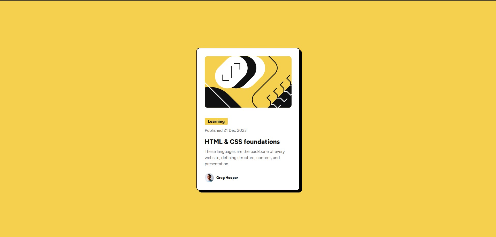

# 🎨 Frontend Mentor - Blog Preview Card

Esta é uma solução para o desafio [Blog Preview Card do Frontend Mentor](https://www.frontendmentor.io/challenges/blog-preview-card-ckP9tdR16). 

## 📋 Sumário

- [Visão Geral](#-visão-geral)
  - [O Desafio](#o-desafio)
  - [Screenshot](#screenshot)
  - [Links](#links)
- [Meu Processo](#-meu-processo)
  - [Tecnologias Utilizadas](#tecnologias-utilizadas)
  - [O que eu aprendi](#o-que-eu-aprendi)
  - [Desenvolvimento Contínuo](#desenvolvimento-contínuo)
- [Autor](#-autor)

---

## 🧐 Visão Geral

### O Desafio

Os usuários devem ser capazes de:

- Visualizar o layout ideal para o componente dependendo do tamanho da tela do dispositivo.
- Ver os estados de `:hover` e foco para todos os elementos interativos da página.

### Screenshot



### Links

- **URL da Solução (GitHub):** [Acesse o repositório](https://github.com/ChristianProgramador/blog-preview-card-main-frontendmentor)
- **URL do Site (GitHub Pages):** [Veja o projeto rodando](https://christianprogramador.github.io/blog-preview-card-main-frontendmentor/) *(ative nas configurações do GitHub se desejar)*

---

## 🛠️ Meu Processo

### Tecnologias Utilizadas

- **HTML5 Semântico** (`<main>`, `<article>`, `<footer>`)
- **CSS3** (Propriedades customizadas / CSS Variables)
- **Flexbox** para alinhamento e estrutura
- **Mobile-first / Responsividade** com Media Queries
- **Efeito Neo-brutalismo** (Sombras marcadas e bordas sólidas)

### O que eu aprendi

Neste projeto, o foco foi dominar a construção semântica e limpa do zero sem dependência de frameworks.

1. **Uso de HTML Semântico e Acessibilidade:**
   Combinação da tag `<h1>` envolvendo uma tag `<a>` para garantir acessibilidade por navegação via teclado sem perder o valor semântico do título principal.

   ```html
   <h1>
     <a href="#">HTML & CSS foundations</a>
   </h1>

2- **Propriedades Dinâmicas no CSS:**
   Uso da propriedade `width: fit-content` para fazer a tag de categoria se ajustar perfeitamente ao tamanho do texto sem engessar dimensões em pixels.

```css
.card-content span {
  background-color: var(--cor-fundo-body);
  width: fit-content;
  padding: 4px 12px;
}
```

3- Neo-brutalismo Visual:
   Criação de sombras rígidas sem desfoque para um visual marcante.

```css
.card {
  box-shadow: 8px 8px 0px #000;
}
```

Desenvolvimento Contínuo
Nos próximos desafios pretendo aprofundar em:

Layouts complexos utilizando CSS Grid.

Arquitetura BEM (Block Element Modifier) para organização de classes.

👤 Autor
GitHub - @ChristianProgramador

Frontend Mentor - @ChristianProgramador.